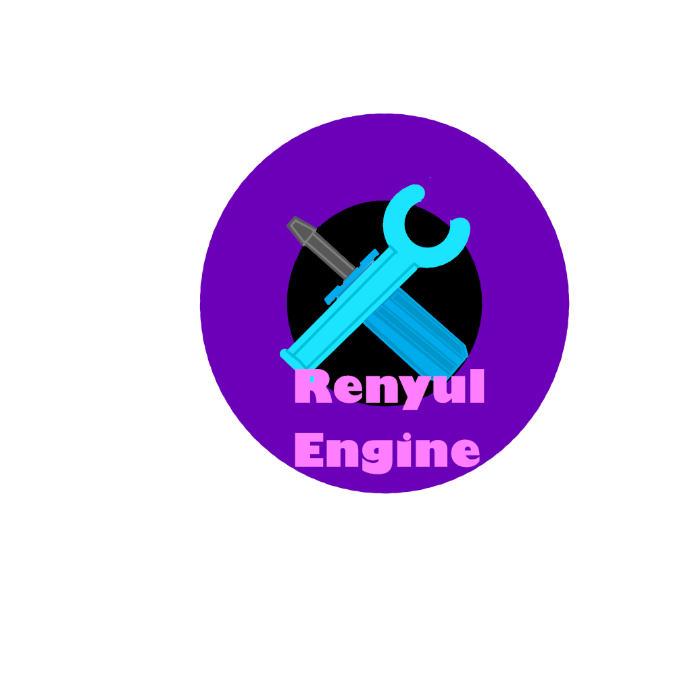

<div align="center">
    
</div>

# Renyul Game Engine Documentation

## Building and Running the Engine

1. **Build the engine and all projects:**
    ```sh
    dotnet build RenyulWorkspace.sln
    ```
2. **Run the demo game (or your own game project):**
    ```sh
    dotnet run --project DemoGame/DemoGame.csproj
    ```
---

Welcome to the Renyul Game Engine! This documentation covers the engine architecture, scripting API, and practical examples to help you build 2D games efficiently.

---

## Table of Contents
- [Overview](#overview)
- [Engine Architecture](#engine-architecture)
- [Core Concepts](#core-concepts)
- [Scripting API](#scripting-api)
- [Game Loop](#game-loop)
- [Scenes](#scenes)
- [Rendering](#rendering)
- [Input](#input)
- [Physics](#physics)
- [Audio](#audio)
- [UI System](#ui-system)
- [Asset Management](#asset-management)
- [Examples](#examples)
- [Extending the Engine](#extending-the-engine)

---

## Overview
Renyul Game Engine is a modular, service-oriented 2D game engine built on MonoGame. It provides a clean API for scenes, rendering, input, physics, audio, UI, and asset management.

---

## Engine Architecture
- **Service Locator Pattern:** All core systems (input, rendering, physics, audio, etc.) are registered as services and can be accessed globally.
- **Scene System:** Each scene encapsulates its own logic, entities, and UI. Scene switching is managed by `SceneManager`.
- **Component-Based Entities:** Entities can have sprites, physics bodies, colliders, and audio sources.

---

## Core Concepts
### Services
All engine systems implement `IService` and are registered with `ServiceLocator`.
```csharp
// Registering a service
ServiceLocator.Register(new Time());
// Accessing a service
var time = ServiceLocator.Get<Time>();
```

### Scenes

---

## Troubleshooting & Common Bug Fixes

Hey! If you run into weird stuff, here are some things that tripped me up (and how I fixed them):

- **Game window is just black or closes instantly:**
    - Double-check your assets are in the right place and the Content pipeline built them. If you see a missing file error, that's probably it.
- **NullReferenceException everywhere:**
    - Usually means you forgot to register a service (like InputSystem or Renderer2D) or tried to use something before it was loaded. Check your `ServiceLocator` calls.
- **Sprites not showing up:**
    - Make sure your textures are loaded and you're actually calling `renderer.Draw()` in your scene's `Render()` method. Also, check your camera zoom/position isn't way off.
- **Input not working:**
    - Did you register your input devices? (KeyboardDevice, MouseDevice, etc.)
- **Physics is acting weird:**
    - Check your collider sizes and positions. Also, make sure you're calling `PhysicsWorld.Step()` with a reasonable delta time.
- **UI buttons don't respond:**
    - Make sure your UI elements are in the update loop and that the mouse position is correct. Sometimes layering or visibility can mess with hit detection.
- **Build errors about missing MonoGame or .NET:**
    - Make sure you have .NET 8 and MonoGame 3.8.4 installed. If you just installed them, try restarting VS Code or your terminal.
- **Something else broke?**
    - Honestly, just check the error message and follow the stack trace. Most of the time it's something silly (typo, missing asset, forgot to add to a list, etc.).

If you get stuck, try cleaning and rebuilding the solution:

```sh
dotnet clean
dotnet build RenyulWorkspace.sln
```

And if you fix a weird bug, add it here! (Sharing is caring.)

Scenes inherit from `Scene` and override `Start`, `Update`, `FixedUpdate`, and `Render`.
```csharp
public class MyScene : Scene {
    protected override void Start() { /* ... */ }
    public override void Update() { /* ... */ }
    public override void Render(Renderer2D renderer) { /* ... */ }
}
```

---

## Scripting API
### Scene Management
```csharp
// Switch to a new scene
SceneManager.Load(new MyScene());
```

### Rendering
```csharp
// Drawing a sprite
var tex = AssetManager.AcquireTexture("player.png");
var sprite = new Sprite(tex);
sprite.Draw(renderer, new Vector2(100, 100));
```

### Input
```csharp
var input = ServiceLocator.Get<InputSystem>();
var keyboard = input.GetDevice<KeyboardDevice>();
if (keyboard.GetKey(Keys.Space)) { /* jump! */ }
```

### Physics
```csharp
var collider = new BoxCollider2D(new Vector2(32, 32));
var rb = new Rigidbody2D(collider);
rb.Position = new Vector2(100, 100);
```

### Audio
```csharp
var sound = AssetManager.AcquireSound("jump.wav");
var src = new AudioSource(sound);
src.Play();
```

### UI System
```csharp
var button = new UIButton { Text = "Click Me" };
button.OnClick += () => { /* handle click */ };
// Add to your scene's UI list
```

---

## Game Loop
- **Update:** Variable-step logic (input, game logic).
- **FixedUpdate:** Fixed-step physics.
- **Render:** Draw everything using `Renderer2D`.

---

## Scenes
- Inherit from `Scene`.
- Override `Start` for initialization.
- Use `SceneManager.Load` to switch scenes.

---

## Rendering
- Use `Renderer2D` for all 2D drawing.
- Load textures and fonts via `AssetManager` or `Renderer2D`.

---

## Input
- Register devices with `InputSystem`.
- Use `GetDevice<KeyboardDevice>()` or `GetDevice<MouseDevice>()`.
- Query key/button states with `GetKey`, `GetKeyDown`, `GetKeyUp`.

---

## Physics
- Add rigidbodies and colliders to your entities.
- Physics is updated in `FixedUpdate`.

---

## Audio
- Use `AudioSource` to play sounds.
- Group sources with `AudioGroup` for volume/mute control.

---

## UI System
- UI elements inherit from `UIElement`.
- Use `UIButton`, `UILabel`, `UISlider`, `UIDropdown`, etc.
- Call `Update` and `Draw` on your UI elements in your scene.

---

## Asset Management
- Use `AssetManager.AcquireTexture`, `AcquireFont`, `AcquireSound` to load assets.
- Assets are reference-counted and cached.

---

## Examples
### Example: Simple Scene
```csharp
public class GameScene : Scene {
    private Sprite? playerSprite;
    private Vector2 playerPos = new(100, 100);
    protected override void Start() {
        var tex = AssetManager.AcquireTexture("player.png");
        playerSprite = new Sprite(tex);
    }
    public override void Update() {
        var input = ServiceLocator.Get<InputSystem>();
        var keyboard = input.GetDevice<KeyboardDevice>();
        if (keyboard.GetKey(Keys.Right)) playerPos.X += 200 * ServiceLocator.Get<Time>().DeltaTime;
        if (keyboard.GetKey(Keys.Left)) playerPos.X -= 200 * ServiceLocator.Get<Time>().DeltaTime;
    }
    public override void Render(Renderer2D renderer) {
        if (playerSprite != null)
            playerSprite.Draw(renderer, playerPos);
    }
}
```

### Example: Main Menu with Button
```csharp
public class MainMenuScene : Scene {
    private UIButton? startButton;
    private readonly List<UIElement> _uiElements = new();
    protected override void Start() {
        startButton = new UIButton { Text = "Start Game" };
        startButton.OnClick += () => SceneManager.Load(new GameScene());
        _uiElements.Add(startButton);
    }
    public override void Update() {
        foreach (var ui in _uiElements) ui.Update();
    }
    public override void Render(Renderer2D renderer) {
        var font = renderer.LoadFont("DefaultFont");
        foreach (var ui in _uiElements) ui.Draw(renderer, font);
    }
}
```

---

## Extending the Engine
- Add new services by implementing `IService` and registering with `ServiceLocator`.
- Create new UI elements by inheriting from `UIElement`.
- Add new asset types by extending `AssetManager`.

---

## License
MIT License. See LICENSE file for details.
